# Errors

1. C101, C102: wrong footprint, 0805 instead of 0603
2. FB100, FB101: wrong footprint, 1206 instead of 0805 but 742792620 should be 0603
3. DNP parts are shown on ibom
4. U103: wrong pinout (should be non-R type), GND and RESET flipped.

# Modifications

1. FB100, FB101: used 742792118 (had the right footprint and was available as leftover from previous projects)
1. R104 changed to 1.2k to adjust charging indicator LED brightness
1. R103 changed to 4.7k to increase charge current to ~ 210 mA

# To Dos

1. Full charging cycle
2. Use a real USB-Power Supply
3. Negative measure current
4. Solder voltage supervisor
5. Measure current consumption

# Battery

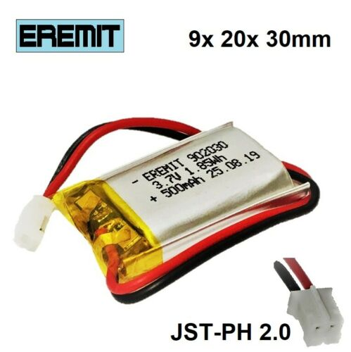

* From ebay "Zertifizierte EREMIT LiPo LiIon Akku Batterie 1S JST-PH 2.0 Stecker GPS Arduino"
* Integrated protection circutry: Overchare, overdischarge, overcurrent

| Parameter                | Symbol  | Value           |
| ------------------------ | ------- | --------------- |
| Technology               |         | Lithium Polymer |
| Dimensions               |         | 9x 20x 30mm     |
| Capacity                 | C       | 500 mAh         |
| Nominal charing current  | I_c,nom | 0,5 C           |
| Maximum charging current | I_c,max | 1 C             |
| Nominal voltage          | V_nom   | 3.7 V           |
| Maximum voltage          | V_max   | 4.2 V           |
| Internal resistance      | R_ESR   | 90 mR - 120 mR  |

# Photos

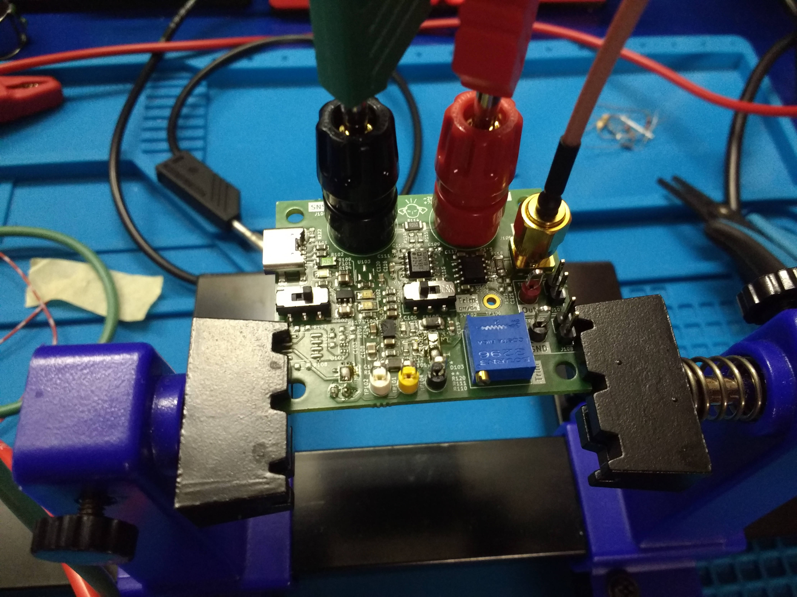 

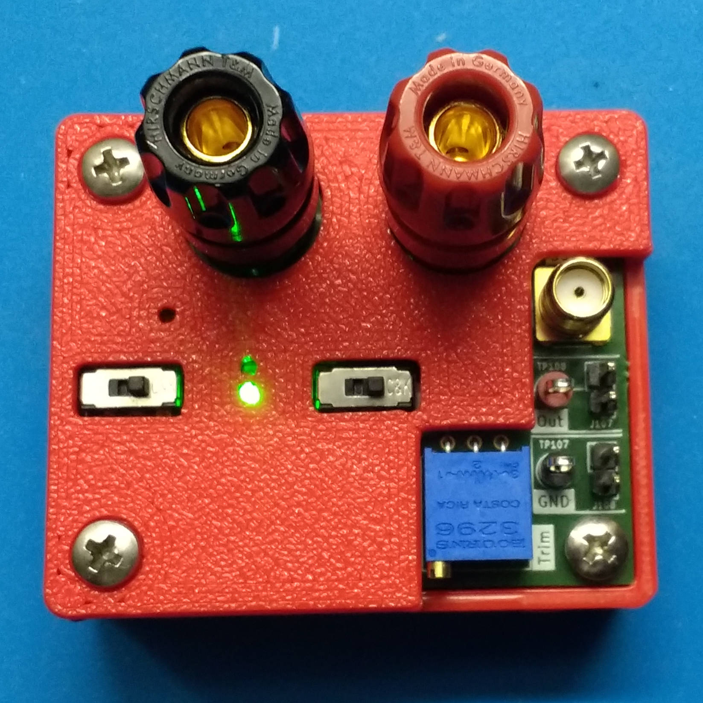 

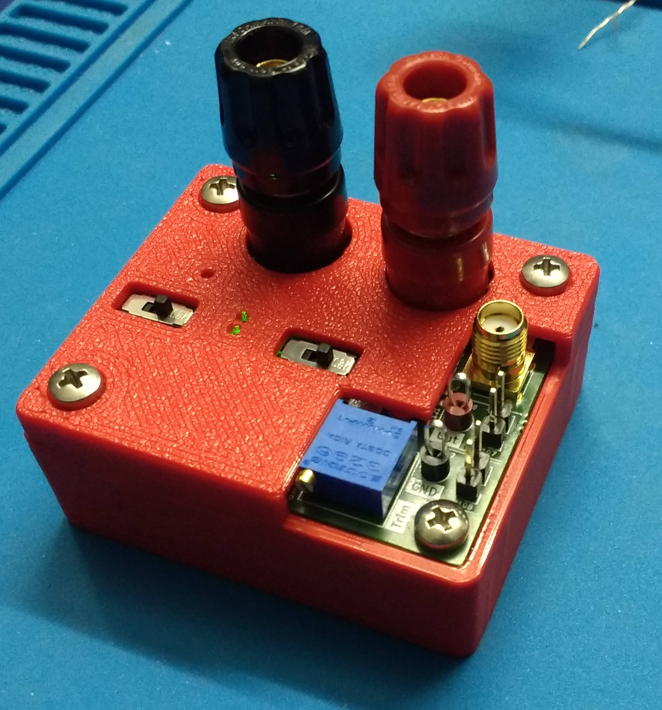 

# Measurements

* `PGOOD` LED turns off below 3.14 V

* `Low_Bat` Turns on at 3 V. Expected but to low. Should be 3.5 V or 3.6 V.
* Charging current = 230 mA
* Current consumption = 15,9 mA (without 50R termination connected to the SMA connector)

## Supply rail voltage ripple

+3V3

V_PP = 4,9 mV

V_RMS = 855 µV

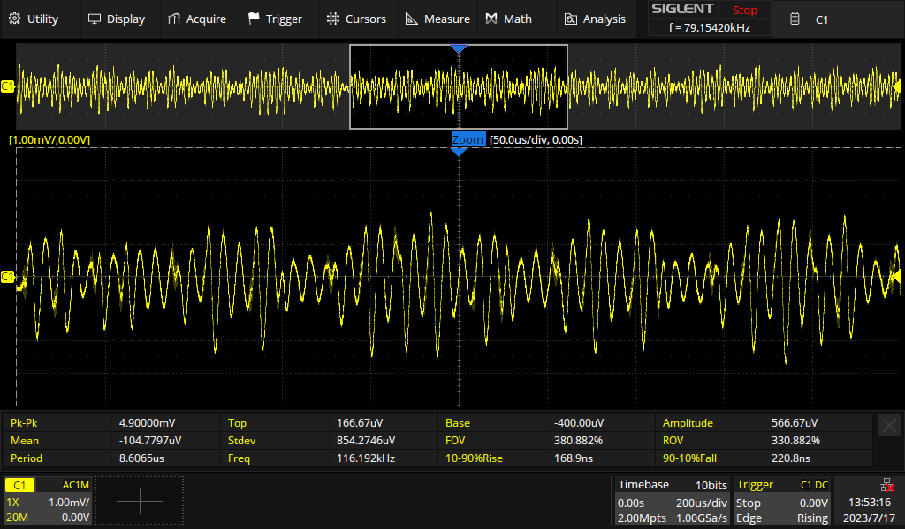

+3V3 after ferrite bead:

V_PP = 4,5 mV

V_RMS = 814 µV

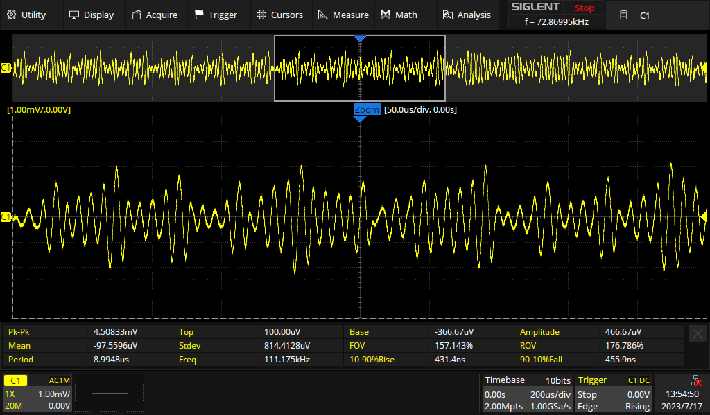

-2V:

V_PP = 5,3 mV

V_RMS = 1,1 mV

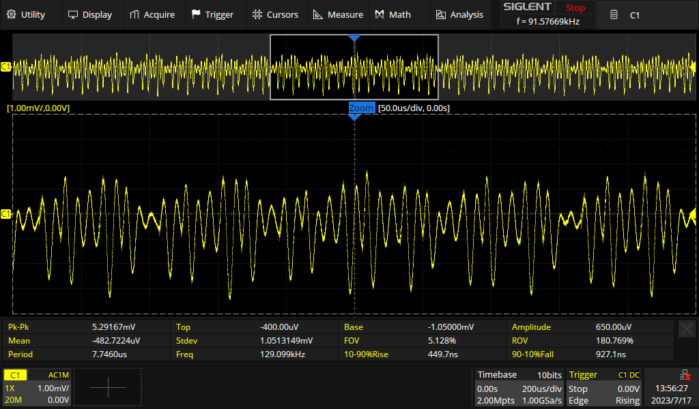

-2V after ferrite bead:

V_PP = 4,13 mV

V_RMS = 800 µV

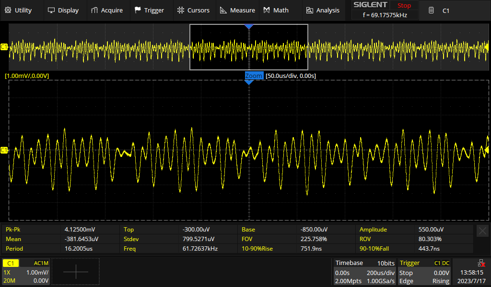

# Output signal noise

5mR sense resistor. CH2 set to high impedance input

CH1: Current sense amplifier output

CH2: 50R buffer output (actually 47R, no termination resistor in scope)

V_PP = 12,5 mV

V_RMS = 1,43 mV

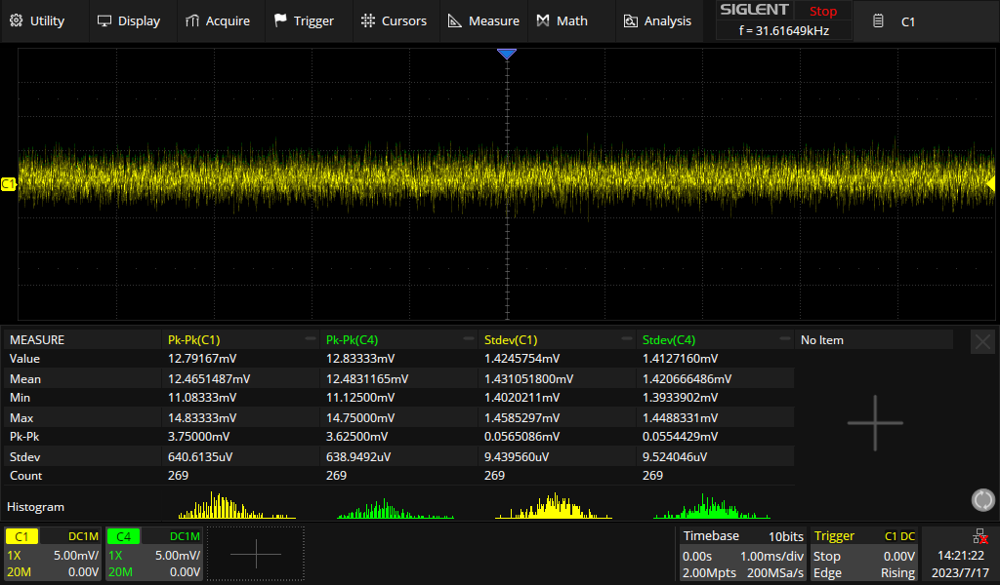

## Correlation with power supply ripple

No obvious correlation. Signal noise seems to be inherent to signal chain, not supply voltage.

F1 = FFT(C1), F2 = FFT(C2)

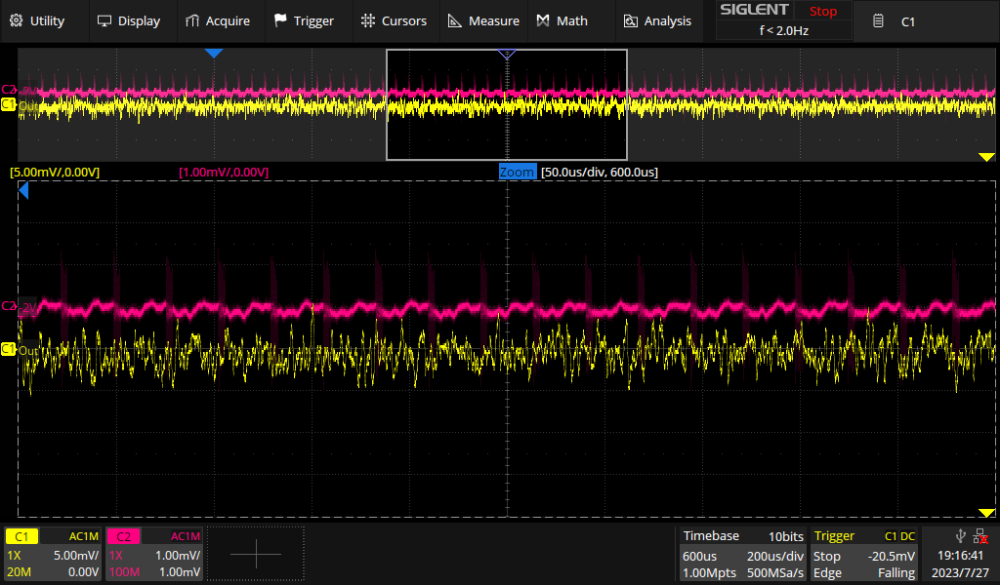

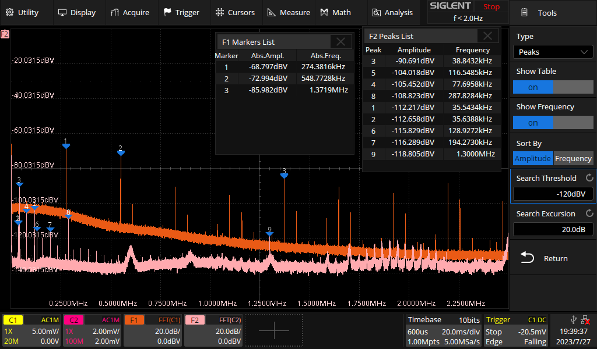

# Accuracy

**Measurement setup:**

* PSU GPP-4323 as power source. Current readings taken from PSU. Accuracy above 50 mA is approx. 1%, below more like 5%.
* DUT directly connected to PSU (constant current, almost short circuit operation)

**Results:**

* 1,5% accuracy approx. from 50 mA to 3 A.

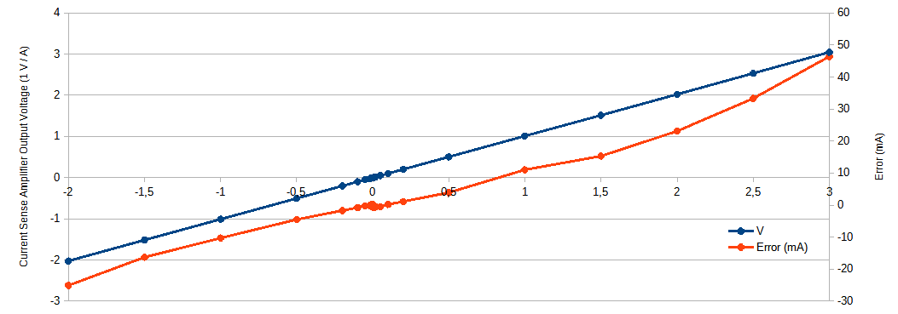

# Frequency Response

## Bode plot

**Measurement setup:**

* Siglent SDS2504X Plus
  * Generator level 3 Vpp (50R)
  * CH1 = DUT voltage output
  * CH2 = Measured generator level
* DUT with 50R in series connected to signal generator (resulting peak to peak current = 3 Vpp / (50R + 50R) = 30 mA)

**Results:**

* 3dB bandwidth = 232 kHz

* Output voltage amplitude in Vpp:

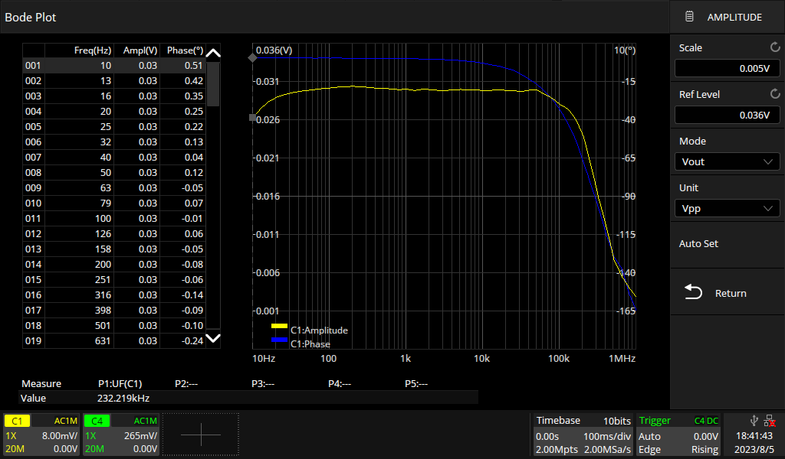 

* CH1 / CH2 in dB (why -34dB? Current sense amplifier is scaling 1 A / 1 V. With 100 R the current is 100 times smaller than the generator voltage. 1/100 = -40dB. The difference of 6dB = 0,5 comes from the voltage divider: generator output resistance and the resistance added to the current path. Both are 50R)

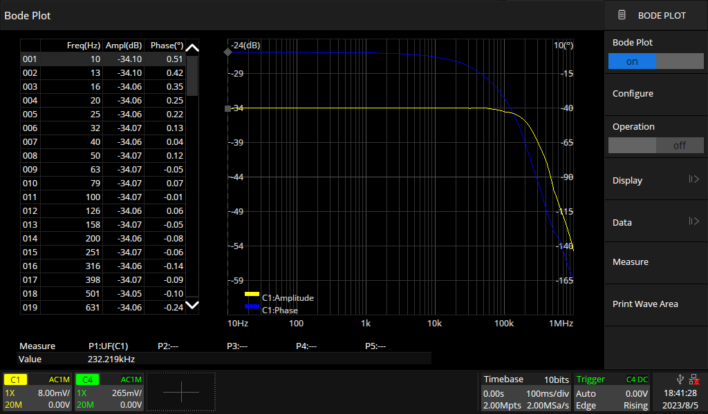 

## Time domain (square wave)

Same measurement setup as in [Bode plot](#Bode plot). The noise is relatively high because of the limited current capability of the signal generator (this applies for the bode plot, too).

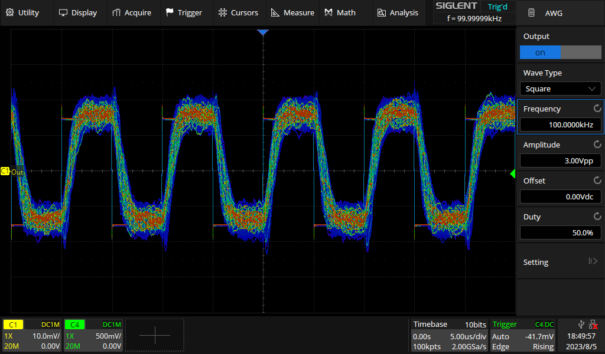 
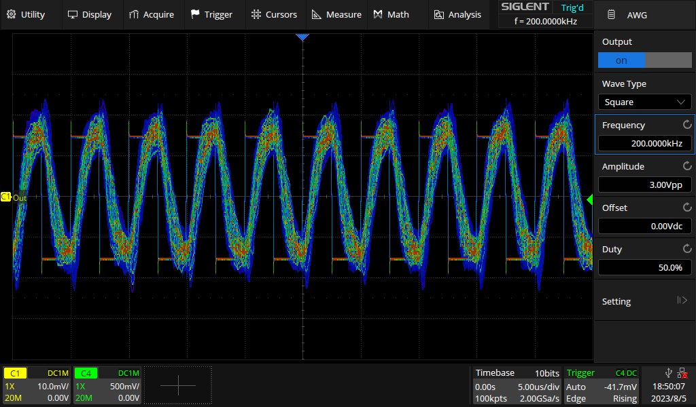 
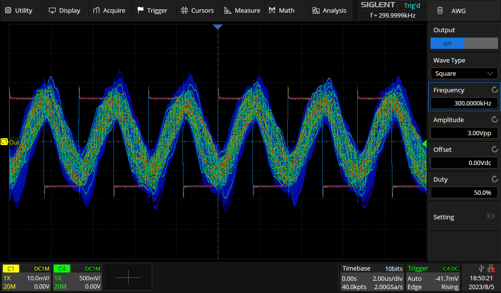 

# Notes

* Trimming potentiometer can be used to increase the positive (or negative) measurement range. Turing it fully left offsets the output voltage to -2 V. This increases the positive current measurement range to 5.3 A (3.3 V - (-2 V)).
