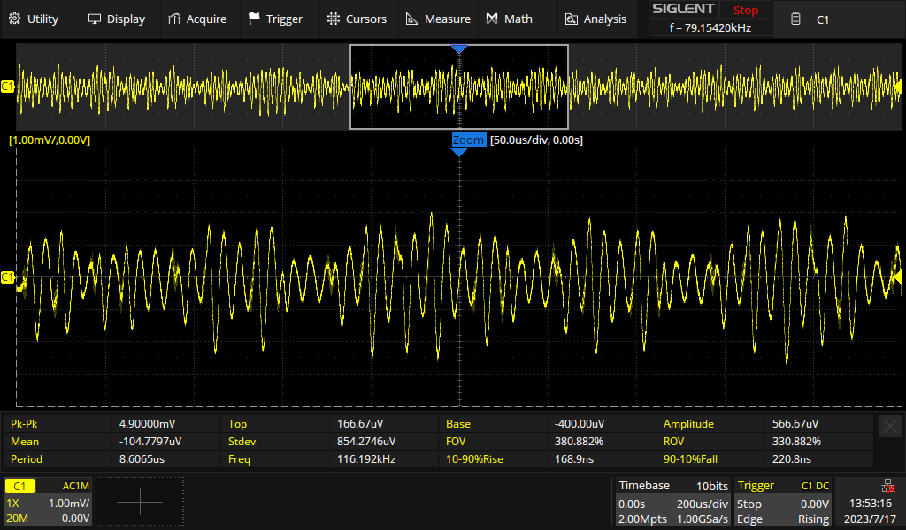
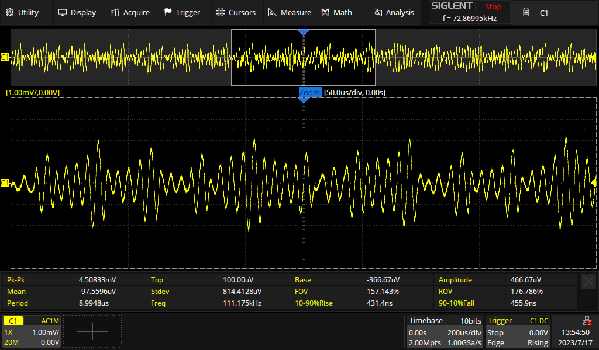
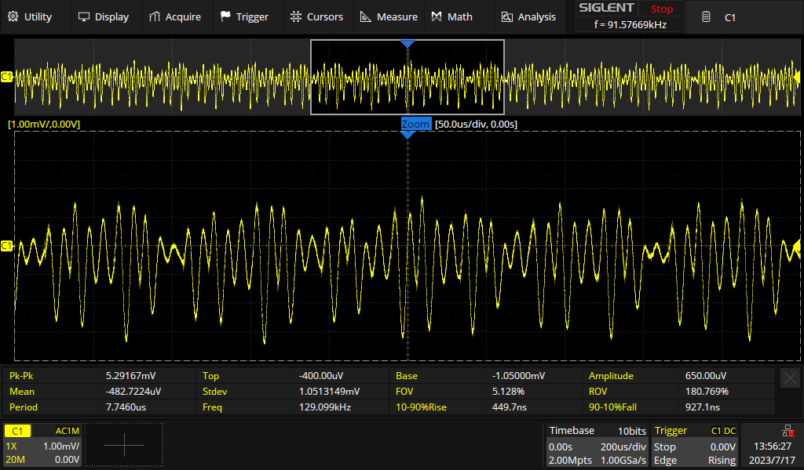
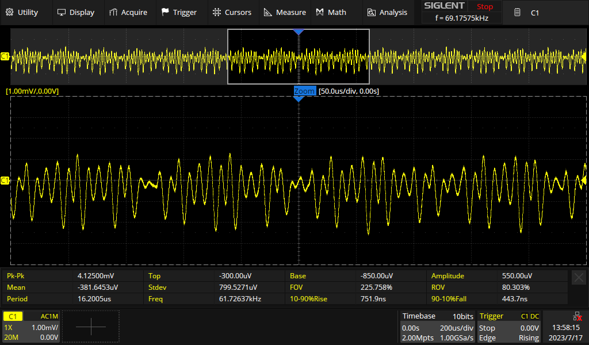
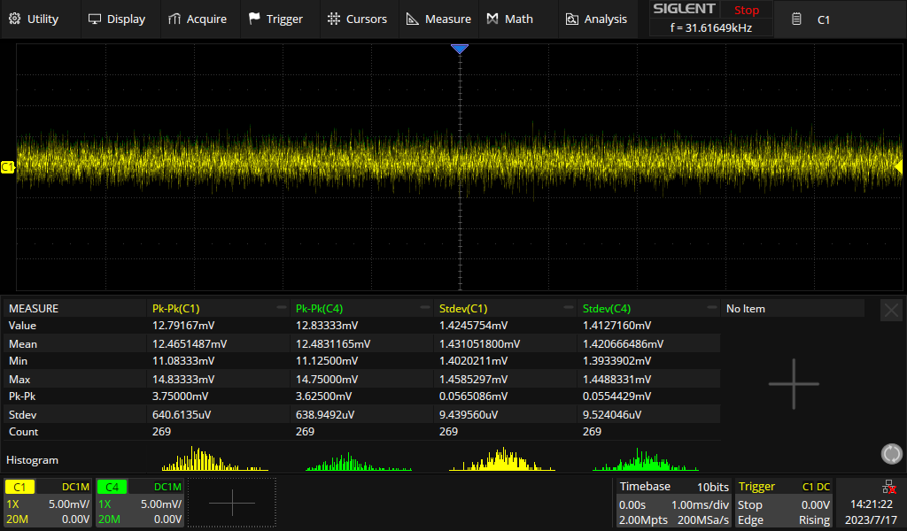

# Errors

1. C101, C102: wrong footprint, 0805 instead of 0603
2. FB100, FB101: wrong footprint, 1206 instead of 0805 but 742792620 should be 0603
3. DNP parts are shown on ibom

# Modifications

1. FB100, FB101: used 742792118
1. R104 changed to 1.2k
1. R103 changed to 4.7k to increase charge current to ~ 210 mA

# To Dos

1. Full charging cycle
2. Use a real USB-Power Supply
3. Negative measure current
4. Solder voltage supervisor
5. Measure current consumption

# Measurements

`PGOOD` LED turns off below 3.14 V

## Supply rail voltage ripple

+3V3

+3V3 after ferrite bead:

-2V:

-2V after ferrite bead:

# Output voltage

5mR sense resistor. CH2 set to high impedance input

CH1: Current sense amplifier output

CH2: 50R buffer output (acually 47R)

