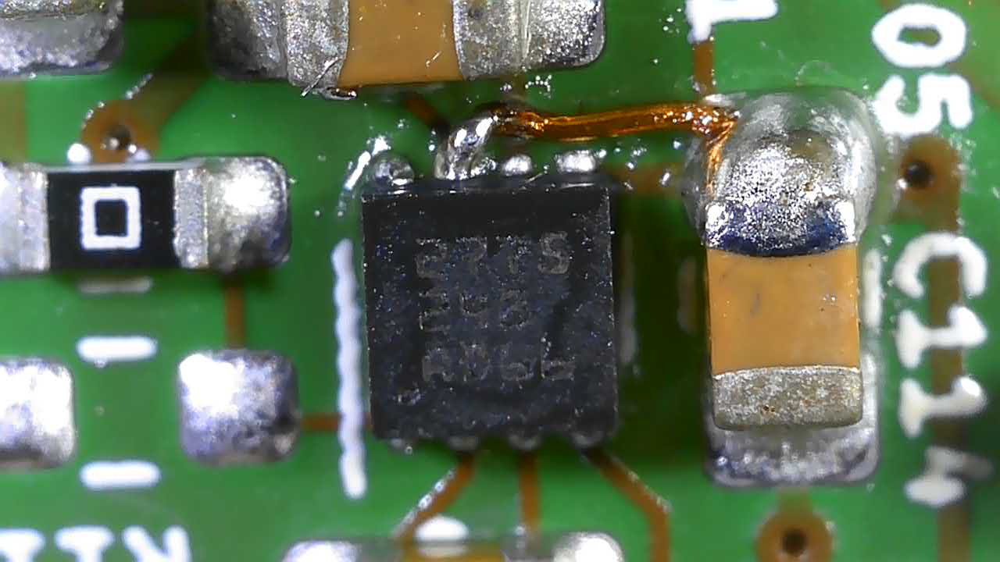
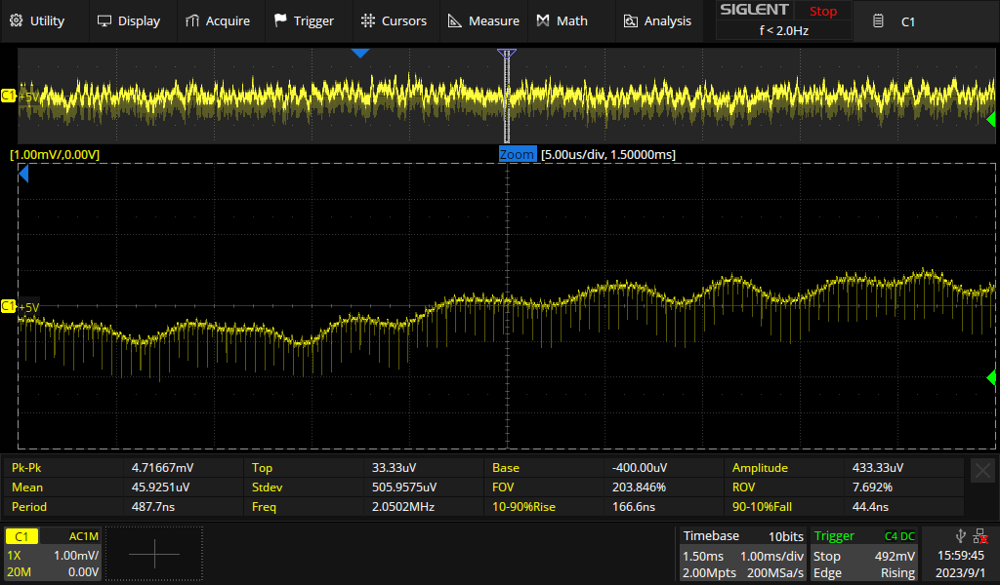
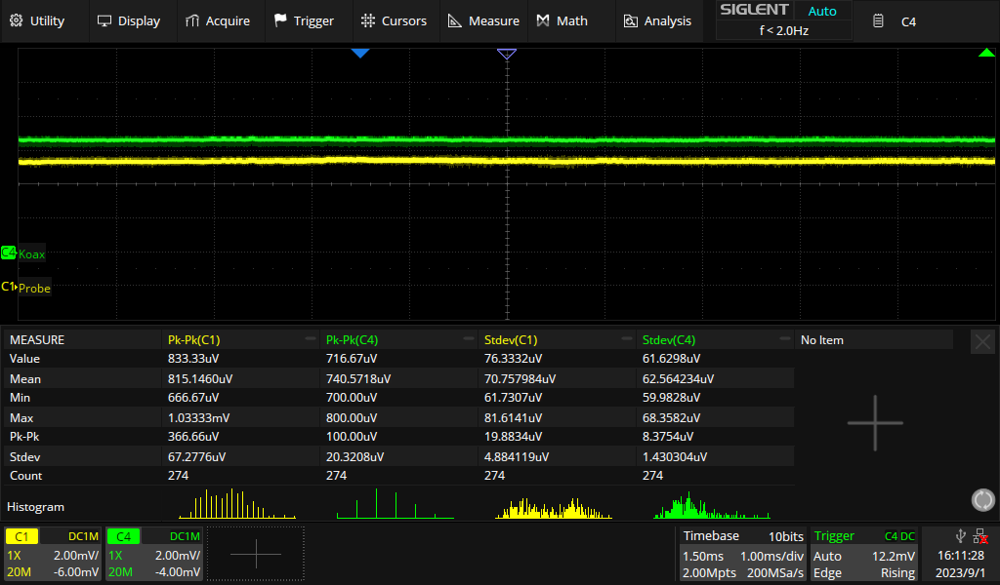
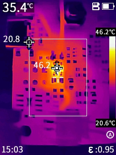
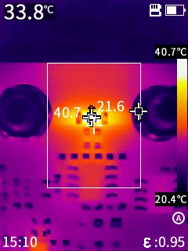
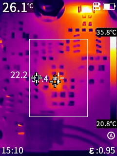
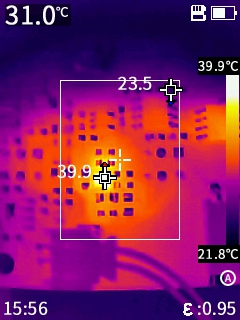
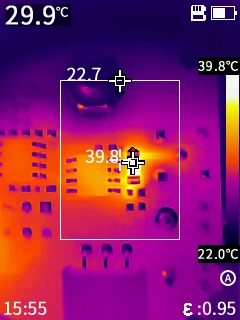
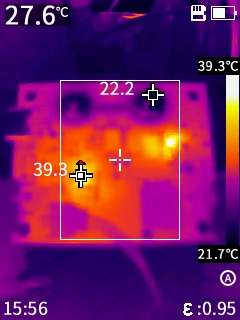

# Changes

1. Change F1 to 0.75 A polyfuse SMD1206B075TF/16
2. Bodge wire to U111 charge pump VIN pin. Othervise the output voltage stayed at 1.6 V. This is due to an layout error: EN was mistaken with VIN. The resulting impedance of the long, narrow track to VIN was obviously to high (the switching frequency is 2 MHz!).
3. 

## +5V voltage ripple

## Output voltage at 0 A

# Thermal Images

## Battery Charger

## Sense Resistor

Tested with 3 A

## Charge Pump

No Load:

Load 50R max. Vout (4.6 V):

## 50R Output Buffer

With 50R load at max. Vout (4.6 V)

Whole PCB

