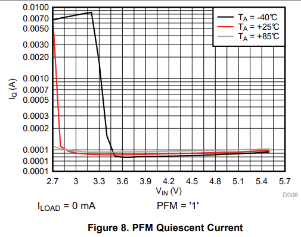
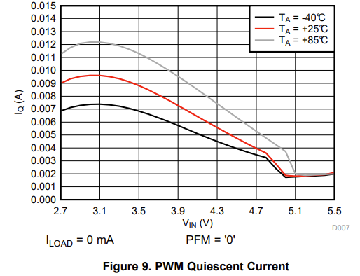
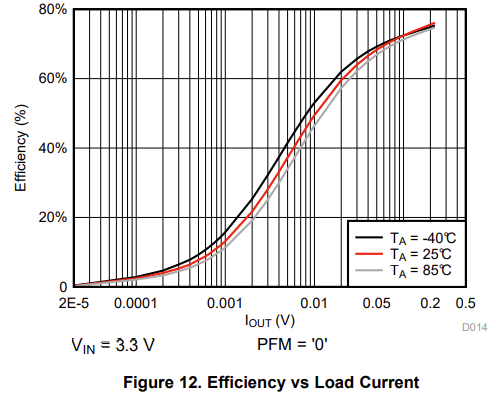
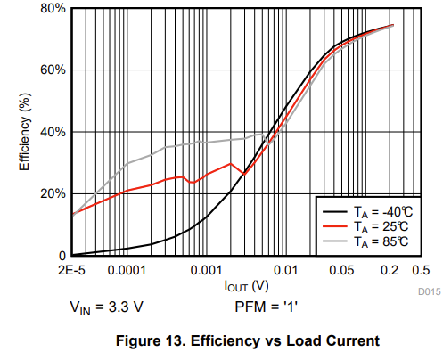
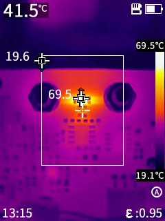

# Modifications

1. Change F1 to 0.75 A polyfuse SMD1206B075TF/16

2. Bodge wire to U111 charge pump VIN pin. Othervise the output voltage stayed at 1.6 V. This is due to an layout error: EN was mistaken with VIN. The resulting impedance of the long, narrow track to VIN was obviously to high (the switching frequency is 2 MHz!).

   

# Power supply

Current consumption is 20 mA. Iq of [LM2775](https://www.ti.com/lit/ds/symlink/lm2775.pdf?ts=1693816107344&ref_url=https%253A%252F%252Fwww.google.com%252F) is 5 mA typ. with forced PWM mode (PFM = 0). Doesn't vary with change of input voltage.

 

In RevA1 current consumption was 7 mA with Vx- = GND (-2V unused but present). The "old" LM27762 had an Iq of 390 µA.

| Component | Quiescent Current (mA) |
| --------- | ---------------------- |
| AD8418A   | 4.1                    |
| AD8655    | 3.7                    |
| LM2775    | 5.0                    |
| **Total** | **12.8**               |

Efficency is around 45%:

$\frac{1}{45\ \%} \cdot (4.1\ +\ 3.7)\ mA =\ 17.3 mA$ so the measurements seem plausible. PFM mode shouldn't improve the results with load current > 7 mA:

## +5V voltage ripple

## Line regulation

## Load regulation

# Output measurements

## Output voltage at 0 A

# Thermal Images

## Battery Charger

## Sense Resistor

@ 3 A, 5 A, 6 A (6 A not in steady state, temp. still slowly rising). Max. continuous current should be limited to 5 A.

  

## Charge Pump

No Load:

Load 50R max. Vout (4.6 V):

## 50R Output Buffer

With 50R load at max. Vout = 4.6 V. The output voltage swing doesn't reach the full 5 V supply voltage. Without 50R load the output voltage is very close to the supply voltage.

Whole PCB:

# Changes for RevC1

1. Increase trace width to sense resistor (main current path)
2. Change distance of binding posts to 3/4 inch to support double banana plugs.
